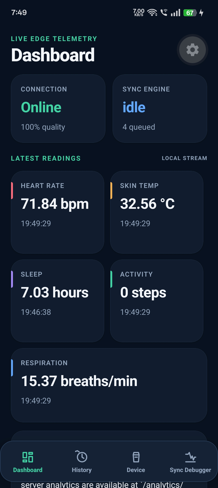
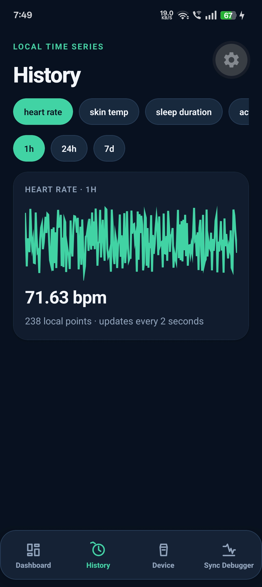
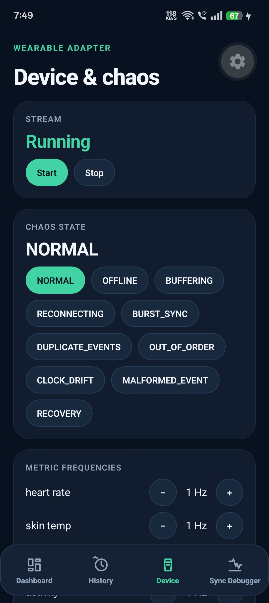
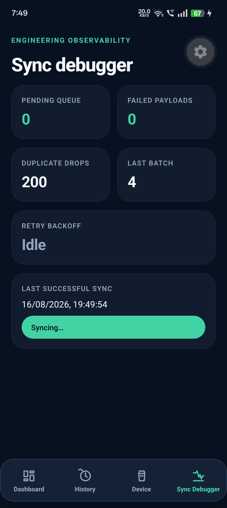

# Aevum

Aevum is a production-minded reference system for continuous wearable telemetry under unreliable network conditions. It demonstrates local-first persistence, idempotent synchronization, retries, clock drift, out-of-order events, duplicate delivery, burst recovery, strict boundary validation, and operational visibility.

> [!IMPORTANT]
> Aevum currently uses **simulated wearable data**. Heart rate, skin temperature, sleep, activity, and respiratory readings are dummy values generated on the device for development and demonstration. This is not a medical product, and its data must not be used for health or clinical decisions.

## Screens

The mobile app has four focused tabs:

| Dashboard | History |
| --- | --- |
| Live connection, synchronization, and latest-reading overview | Locally persisted time-series readings and metric windows |
|  |  |

| Device | Sync Debugger |
| --- | --- |
| Simulator controls, frequencies, and network-chaos modes | Queue state, retries, failures, duplicate drops, and manual sync |
|  |  |

> A small personal note: I am not a UI specialist, so please forgive any slightly goofy edges in the interface. The focus of this project is its offline-first data flow, synchronization behavior, and failure handling—but the UI is being polished as the project evolves.

## Stack

- Expo SDK 57, React Native 0.86, and React 19
- Expo development client for physical-device testing
- SQLite WAL storage on the mobile device
- FastAPI, Pydantic, SQLAlchemy, and AsyncPG
- PostgreSQL 17
- pnpm workspaces with shared TypeScript contracts
- Docker Compose for the backend development environment

## Repository layout

```text
apps/mobile                 Expo/React Native application
apps/api                    FastAPI service and PostgreSQL model
packages/contracts          Shared domain and transport schemas
packages/sensor-simulator   Wearable adapter and chaos simulator
docs/architecture.md        Architecture and failure-recovery notes
docker-compose.yml          API and PostgreSQL development services
```

## Prerequisites

- Node.js 22.13 or newer
- pnpm 9 (`corepack enable` is recommended)
- Docker Desktop with Docker Compose
- An Expo account for creating the Android development build
- Android SDK platform tools if installing through USB
- Python 3.11 or newer only when running the API outside Docker

## First-time setup

Install the workspace dependencies from the repository root:

```powershell
cd D:\Projects\aevum
corepack enable
pnpm install
```

Create the mobile environment file if it does not exist:

```powershell
Copy-Item apps/mobile/.env.example apps/mobile/.env
```

For a physical phone, replace `localhost` with the development computer's LAN IPv4 address:

```dotenv
EXPO_PUBLIC_API_URL=http://192.168.1.3:8000
```

The phone and computer must be on the same network. The address may change when reconnecting to Wi-Fi; check it with `ipconfig`.

## ▶ Start Aevum

### 1. Start the backend

From the repository root:

```powershell
cd D:\Projects\aevum
docker compose up --build -d
docker compose ps
```

Confirm that the API is healthy:

```powershell
Invoke-RestMethod http://localhost:8000/health
```

Useful backend URLs:

- Health: `http://localhost:8000/health`
- OpenAPI documentation: `http://localhost:8000/docs`
- Readings: `http://localhost:8000/readings`
- Analytics: `http://localhost:8000/analytics/summary`

### 2. Install the Android development build

SDK 57 is newer than the generally available Play Store Expo Go runtime. Use the Aevum development build instead of Expo Go.

This is normally required only once, and again after changing native dependencies or native app configuration:

```powershell
cd D:\Projects\aevum\apps\mobile
pnpm dlx eas-cli@latest login
pnpm dlx eas-cli@latest build --platform android --profile development
```

Install the APK from the EAS build link on the Android device. Open **Wearable Aevum**, not Expo Go.

### 3. Start Metro

```powershell
cd D:\Projects\aevum\apps\mobile
pnpm start:dev-client --clear --tunnel
```

Open the installed Aevum development build and connect to Metro. JavaScript-only changes do not require rebuilding the APK.

### 4. Start the simulated wearable

In the app:

1. Open **Device**.
2. Press **Start** under Stream.
3. Return to **Dashboard** to see live dummy readings.
4. Open **History** after a few seconds to inspect locally persisted data.
5. Use **Device** to select chaos conditions.
6. Watch uploads, retries, and queue state in **Sync Debugger**.

## ■ Stop Aevum

Stop Metro in its terminal with `Ctrl+C`, then stop the backend:

```powershell
cd D:\Projects\aevum
docker compose down
```

To stop containers while retaining the PostgreSQL volume, use the command above. To start them again later:

```powershell
docker compose up -d
```

## Demo scenarios

The Device tab exposes ten simulator states:

- Normal delivery
- Offline buffering
- Reconnecting behavior
- Buffered delivery
- Burst synchronization
- Recovery
- Duplicate events
- Out-of-order events
- Malformed events
- Clock drift

Try starting in normal mode, switching offline for several seconds, and then selecting burst sync or recovery. The Dashboard, History, and Sync Debugger tabs show how the system behaves throughout the transition.

## Verification

Run the JavaScript and TypeScript checks from the repository root:

```powershell
pnpm check
pnpm test
pnpm build
```

Run the Python checks with the API virtual environment:

```powershell
cd D:\Projects\aevum\apps\api
& "$env:LOCALAPPDATA\Programs\Python\Python312\python.exe" -m venv .venv
.\.venv\Scripts\python.exe -m pip install -e ".[dev]"
.\.venv\Scripts\python.exe -m pytest
.\.venv\Scripts\python.exe -m ruff check .
```

## API endpoints

- `POST /readings/batch` accepts 1–100 events and reports accepted and rejected IDs.
- `GET /readings` supports metric, device, time, limit, and offset filters.
- `GET /devices/{id}/status` reports last-seen time, ingestion count, and stream health.
- `GET /analytics/summary` calculates count, minimum, maximum, and average over a rolling window.
- `GET /health` reports service health.
- `GET /docs` serves interactive OpenAPI documentation.

The API treats replay of an existing event ID as accepted without inserting it twice. Reusing a device sequence number with a different event ID is rejected because it indicates divergent device history.

## Troubleshooting

### Expo Go says the project requires a newer version

Do not downgrade the project. Install the SDK 57 development APK and open the project with **Wearable Aevum**, not Expo Go.

### The phone cannot reach the backend

- Confirm the phone and computer are on the same Wi-Fi network.
- Use the computer's LAN address in `apps/mobile/.env`, not `localhost`.
- Confirm `http://<LAN-IP>:8000/health` opens from the phone.
- Allow TCP port 8000 through Windows Firewall if necessary.
- Restart Metro after changing `.env`.

### `adb` is not found

Set the Android SDK variables and include platform tools in the current shell:

```powershell
$env:ANDROID_HOME = "D:\Android\Sdk"
$env:ANDROID_SDK_ROOT = "D:\Android\Sdk"
$env:Path = "D:\Android\Sdk\platform-tools;$env:Path"
adb devices
```

### Python version is rejected

The API requires Python 3.11+. Recreate `.venv` using Python 3.11 or 3.12; an existing Python 3.10 environment is not upgraded by running `venv` again.

### Metro appears to serve stale code

```powershell
cd D:\Projects\aevum\apps\mobile
pnpm start:dev-client --clear --tunnel
```

## Data and safety

All readings currently originate from `packages/sensor-simulator`. Values are deliberately synthetic and may be delayed, duplicated, reordered, malformed, or time-shifted to exercise failure handling. Aevum does not connect to a real wearable in this repository and does not provide medical advice, diagnosis, monitoring, or emergency functionality.
