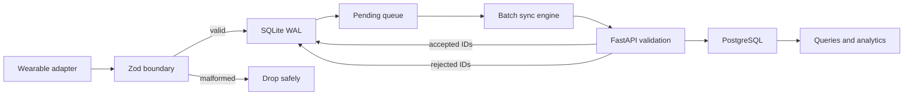
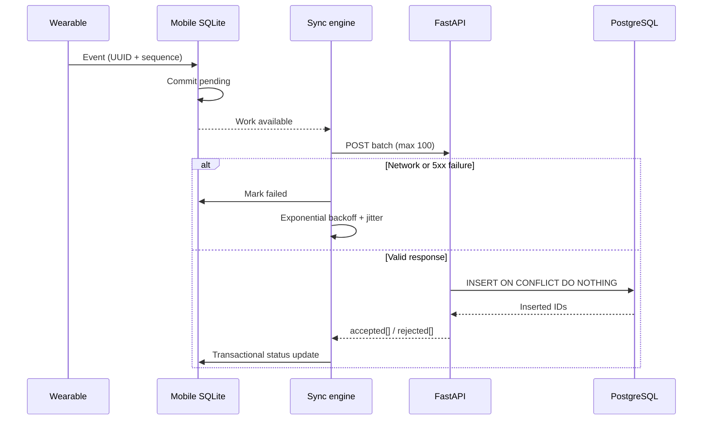

# System architecture

## Data flow

The simulator implements the same `WearableAdapter` contract intended for a future BLE adapter. Raw events cross a Zod validation boundary before entering the application. Valid events are committed to SQLite in WAL mode before the sync engine is notified. The engine uploads bounded batches and changes local state only from explicit server acknowledgements.

## Core invariants

1. Event identity and monotonic sequence are assigned at the edge.
2. A local commit completes before any transport attempt.
3. Only an accepted ID from a successful response marks an event synced.
4. UUID and `(device_id, sequence_number)` are independent idempotency boundaries.
5. Event time (`measuredAt`) is never replaced by ingestion time (`receivedAt`).
6. Out-of-order timestamps are valid; malformed wire shapes are not.
7. A replayed ID is acknowledged without inserting another row.

## The 20-minute offline recovery

At 1 Hz for four active metrics, a 20-minute outage creates roughly 4,800 local records. The adapter enters `OFFLINE` or `BUFFERING`; events continue receiving IDs and sequence numbers and are held by the simulator until delivery resumes. Once delivered, the application validates and commits them locally. Network failures move local rows to `failed`, which remains eligible for retry.

On recovery, the simulator's `BURST_SYNC`/`RECOVERY` state flushes its queue. The sync engine reads at most 100 rows at a time, preserving bounded memory and request sizes. Failed HTTP attempts use exponential backoff capped at 60 seconds with ±25% jitter, preventing synchronized client retry storms. A successful API response updates accepted rows in a SQLite transaction, then immediately processes the next batch.

If connectivity drops after PostgreSQL commits but before the client receives the response, the next request contains duplicate UUIDs. PostgreSQL's primary key prevents duplication and the API acknowledges those known UUIDs as accepted, allowing the mobile queue to converge.

## Chaos semantics

| State | Behavior |
|---|---|
| `NORMAL` | Emits each configured metric at its requested frequency. |
| `OFFLINE` | Generates and buffers readings while disconnected. |
| `BUFFERING` | Performs high-rate edge buffering without output. |
| `RECONNECTING` | Buffers events and simulates exponential handshake delay/failure. |
| `BURST_SYNC` | Shuffles and flushes all simulator-buffered events. |
| `DUPLICATE_EVENTS` | Delivers the same ID and sequence twice. |
| `OUT_OF_ORDER` | Accumulates small windows and delivers randomized order. |
| `CLOCK_DRIFT` | Offsets event time by the configured number of minutes. |
| `MALFORMED_EVENT` | Sends an invalid shape only through the raw/untrusted channel. |
| `RECOVERY` | Flushes buffered data, reconnects, and returns to normal. |

## Database layout

`readings.id` is the primary key. A unique constraint covers `(device_id, sequence_number)`. Composite indexes support metric-by-event-time and device-by-event-time access. Analytics aggregate directly over event time, so delayed arrival does not move readings into the wrong physiological window.

For very high production volume, the next evolution would be monthly PostgreSQL range partitions on `measured_at`, retention policies, and a migration system such as Alembic instead of startup-time `create_all`.

## Defensive boundaries

- The simulator's typed subscription never receives malformed fixtures.
- The raw mobile subscription uses `safeParse`; invalid events are dropped without crashing React.
- Pydantic rejects extra/missing/illegal fields before the ingestion transaction.
- SQLite and PostgreSQL both enforce uniqueness, protecting against concurrent and repeated work.
- Response parsing is strict; an invalid server response cannot accidentally mark data synced.
